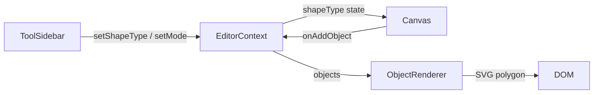

# Design Document

## Feature: geometric-shapes-expansion

---

## Overview

Фича закрывает разрыв между частичной реализацией новых фигур (трапеция, ромб, параллелограмм) в `Canvas.tsx` и `ToolSidebar.tsx` и отсутствием этих значений в типе `shapeType` в `EditorContext.tsx`.

Анализ кодовой базы показал:
- `Canvas.tsx` уже содержит `switch`-ветки для `'trapezoid'`, `'rhombus'`, `'parallelogram'` — создание объектов и preview overlay реализованы.
- `ToolSidebar.tsx` уже содержит кнопки, иконки и маппинг `shapeToolToType` для трёх новых фигур.
- `EditorContext.tsx` — единственный файл, требующий изменений: тип `shapeType` не включает три новых значения, что вызывает TypeScript-ошибки.
- `ObjectRenderer.tsx` — рендеринг `polygon` уже корректно обрабатывает нормализованные вершины; новые фигуры создаются как `type: 'polygon'`, поэтому ObjectRenderer не требует изменений.

Таким образом, объём изменений минимален: **одна строка в `EditorContext.tsx`**.

---

## Architecture



Новые фигуры полностью вписываются в существующий pipeline:
1. Пользователь выбирает инструмент в `ToolSidebar` → вызывается `setShapeType('trapezoid' | 'rhombus' | 'parallelogram')` и `setMode('shape')`.
2. `Canvas` читает `shapeType` из контекста, при рисовании создаёт `Polygon_Object` с нормализованными вершинами.
3. `ObjectRenderer` рендерит `Polygon_Object` через существующую ветку `case 'polygon'`.

---

## Components and Interfaces

### EditorContext.tsx — единственный изменяемый файл

Текущий тип:
```typescript
shapeType: 'rectangle' | 'circle' | 'triangle' | 'polygon'
         | 'geoshape-circle' | 'geoshape-triangle' | 'geoshape-quad';
```

После изменения:
```typescript
shapeType: 'rectangle' | 'circle' | 'triangle' | 'polygon'
         | 'geoshape-circle' | 'geoshape-triangle' | 'geoshape-quad'
         | 'trapezoid' | 'rhombus' | 'parallelogram';
```

Изменение затрагивает:
- Тип `EditorContextValue['shapeType']` (интерфейс)
- Тип `useState<EditorContextValue['shapeType']>` (инициализация)

### Canvas.tsx — изменений не требуется

Уже содержит:
- `case 'trapezoid'`, `case 'rhombus'`, `case 'parallelogram'` в `handleCanvasPointerUp` (создание объектов)
- Ветки preview overlay для трёх фигур в JSX

### ObjectRenderer.tsx — изменений не требуется

Ветка `case 'polygon'` уже корректно рендерит любые нормализованные вершины:
```typescript
const pts = d.points.map(p =>
  `${x + p.x * obj.width},${y + p.y * obj.height}`
).join(' ');
```

### ToolSidebar.tsx — изменений не требуется

Уже содержит:
- Иконки `TrapezoidIcon`, `RhombusIcon`, `ParallelogramIcon` (inline SVG)
- Кнопки в группе `'shapes'`
- Маппинг `shapeToolToType` для трёх новых значений

---

## Data Models

### Polygon_Object (существующий тип, без изменений)

```typescript
{
  id: string;
  type: 'polygon';
  x: number;        // левый верхний угол bounding box
  y: number;
  width: number;
  height: number;
  rotation: number;
  opacity: number;
  visible: boolean;
  locked: boolean;
  data: {
    points: Array<{ x: number; y: number }>; // нормализованные [0..1]
    fill: string;
    stroke: string;
    strokeWidth: number;
  };
}
```

### Нормализованные вершины новых фигур

| Фигура | points |
|--------|--------|
| Трапеция | `[{x:0.2,y:0},{x:0.8,y:0},{x:1,y:1},{x:0,y:1}]` |
| Ромб | `[{x:0.5,y:0},{x:1,y:0.5},{x:0.5,y:1},{x:0,y:0.5}]` |
| Параллелограмм | `[{x:0.25,y:0},{x:1,y:0},{x:0.75,y:1},{x:0,y:1}]` |

Формула вычисления абсолютных координат SVG:
```
px = vertex.x * object.width  + object.x
py = vertex.y * object.height + object.y
```

### Обработка отрицательных width/height при рисовании

Когда пользователь тянет влево или вверх, `shapeDrawEnd` может быть меньше `shapeDrawStart`. Canvas нормализует это перед созданием объекта:
```typescript
const sx = Math.min(shapeDrawStart.x, shapeDrawEnd.x);
const sy = Math.min(shapeDrawStart.y, shapeDrawEnd.y);
const w  = Math.abs(shapeDrawEnd.x - shapeDrawStart.x);
const h  = Math.abs(shapeDrawEnd.y - shapeDrawStart.y);
```
Нормализованные вершины `[0..1]` всегда корректны, так как `w` и `h` всегда неотрицательны.

---

## Correctness Properties

*A property is a characteristic or behavior that should hold true across all valid executions of a system — essentially, a formal statement about what the system should do. Properties serve as the bridge between human-readable specifications and machine-verifiable correctness guarantees.*

### Property 1: Нормализованные вершины новых фигур

*For any* значения `shapeType` из `{'trapezoid', 'rhombus', 'parallelogram'}` и любой области рисования с `width > 5` и `height > 5`, созданный объект должен иметь `type: 'polygon'` и `data.points`, точно совпадающие с эталонными нормализованными вершинами для данного `shapeType`.

**Validates: Requirements 2.1, 2.2, 2.3**

---

### Property 2: Минимальный размер — объект не создаётся

*For any* области рисования, где `width ≤ 5` или `height ≤ 5`, при любом `shapeType` из новых фигур объект не должен добавляться в список объектов холста.

**Validates: Requirements 2.4**

---

### Property 3: Стили по умолчанию для новых фигур

*For any* нового объекта, созданного с `shapeType` из `{'trapezoid', 'rhombus', 'parallelogram'}`, поля `data.fill`, `data.stroke`, `data.strokeWidth` должны быть равны `'#F59E0B'`, `'#D97706'`, `2` соответственно.

**Validates: Requirements 2.5**

---

### Property 4: Формула вычисления SVG points

*For any* `Polygon_Object` с произвольными `x`, `y`, `width`, `height` и произвольным набором нормализованных вершин, атрибут `points` SVG-элемента `<polygon>` должен быть вычислен по формуле `px = vertex.x * width + x`, `py = vertex.y * height + y` для каждой вершины.

**Validates: Requirements 3.1**

---

### Property 5: Атрибуты стиля при рендеринге

*For any* `Polygon_Object` с произвольными `data.fill`, `data.stroke`, `data.strokeWidth`, `opacity`, рендеренный SVG-элемент должен иметь соответствующие атрибуты `fill`, `stroke`, `strokeWidth`, `opacity`.

**Validates: Requirements 3.2**

---

### Property 6: Selection ring для polygon

*For any* `Polygon_Object` при `isSelected = true`, рендеренный SVG должен содержать прямоугольный элемент с атрибутами SEL (`stroke: '#F59E0B'`, `strokeDasharray: '5,5'`), охватывающий bounding box объекта.

**Validates: Requirements 3.3**

---

### Property 7: dragDelta применяется к координатам

*For any* `Polygon_Object` и произвольного `dragDelta = {dx, dy}` при `isSelected = true`, все вычисленные абсолютные координаты вершин в SVG должны быть смещены на `(dx, dy)` относительно базовых координат.

**Validates: Requirements 3.4**

---

### Property 8: Preview overlay вершины соответствуют shapeType

*For any* `shapeType` из `{'trapezoid', 'rhombus', 'parallelogram'}` и произвольной области рисования `(x, y, w, h)`, вершины preview overlay должны быть вычислены как `vertex.x * w + x`, `vertex.y * h + y` с использованием эталонных нормализованных вершин для данного `shapeType`.

**Validates: Requirements 4.1, 4.2, 4.3**

---

### Property 9: Перемещение не изменяет data.points

*For any* `Polygon_Object` (включая трапецию, ромб, параллелограмм) и произвольного `applyDelta(dx, dy)`, поле `data.points` объекта после перемещения должно оставаться идентичным исходному.

**Validates: Requirements 6.3**

---

### Property 10: Обработчики кнопок ToolSidebar

*For any* кнопки из `{'shape-trapezoid', 'shape-rhombus', 'shape-parallelogram'}`, клик по кнопке должен вызывать `setShapeType` с соответствующим значением и `setMode('shape')`.

**Validates: Requirements 5.2, 5.3, 5.4**

---

## Error Handling

| Ситуация | Поведение |
|----------|-----------|
| `width ≤ 5` или `height ≤ 5` при рисовании | Объект не создаётся (существующая проверка `if (w > 5 && h > 5)`) |
| Отрицательные `shapeDrawEnd - shapeDrawStart` | Нормализация через `Math.min` / `Math.abs` перед созданием объекта |
| `data.points` отсутствует или пуст | Ветка `case 'polygon'` в ObjectRenderer вычислит пустую строку `pts = ''`, SVG `<polygon>` не отобразится |
| Неизвестный `shapeType` в switch | Ветка `default` создаёт прямоугольник (существующее поведение) |

---

## Testing Strategy

### Dual Testing Approach

Используются два взаимодополняющих подхода:
- **Unit tests**: конкретные примеры, граничные случаи, проверка DOM
- **Property tests**: универсальные свойства для всех входных данных

### Unit Tests

Конкретные примеры и граничные случаи:

1. **TypeScript compilation** — `tsc --noEmit` не выдаёт ошибок после добавления новых значений в тип (Requirements 1.1–1.3)
2. **ToolSidebar rendering** — кнопки `shape-trapezoid`, `shape-rhombus`, `shape-parallelogram` присутствуют в DOM с SVG-иконками (Requirements 5.1, 5.5)
3. **Edge case: w=5, h=5** — объект не создаётся при граничных значениях
4. **Edge case: отрицательное направление рисования** — объект создаётся корректно при `shapeDrawEnd < shapeDrawStart`

### Property-Based Tests

Библиотека: **fast-check** (уже используется в проекте или легко добавляется как dev-зависимость).

Конфигурация: минимум **100 итераций** на каждый тест (`numRuns: 100`).

Каждый тест помечается комментарием:
```
// Feature: geometric-shapes-expansion, Property N: <property_text>
```

**Тест Property 1** — нормализованные вершины:
```typescript
// Feature: geometric-shapes-expansion, Property 1: normalized vertices match shapeType
fc.assert(fc.property(
  fc.constantFrom('trapezoid', 'rhombus', 'parallelogram'),
  fc.float({ min: 6, max: 1000 }),
  fc.float({ min: 6, max: 1000 }),
  fc.float({ min: 0, max: 1000 }),
  fc.float({ min: 0, max: 1000 }),
  (shapeType, w, h, sx, sy) => {
    const obj = createShapeObject(shapeType, sx, sy, w, h);
    expect(obj.type).toBe('polygon');
    expect(obj.data.points).toEqual(EXPECTED_POINTS[shapeType]);
  }
), { numRuns: 100 });
```

**Тест Property 2** — минимальный размер:
```typescript
// Feature: geometric-shapes-expansion, Property 2: no object created for small areas
fc.assert(fc.property(
  fc.constantFrom('trapezoid', 'rhombus', 'parallelogram'),
  fc.oneof(
    fc.record({ w: fc.float({ max: 5 }), h: fc.float({ min: 6, max: 1000 }) }),
    fc.record({ w: fc.float({ min: 6, max: 1000 }), h: fc.float({ max: 5 }) }),
  ),
  (shapeType, { w, h }) => {
    const result = tryCreateShapeObject(shapeType, 0, 0, w, h);
    expect(result).toBeNull();
  }
), { numRuns: 100 });
```

**Тест Property 4** — формула SVG points:
```typescript
// Feature: geometric-shapes-expansion, Property 4: SVG points formula
fc.assert(fc.property(
  fc.record({
    x: fc.float({ min: 0, max: 1000 }),
    y: fc.float({ min: 0, max: 1000 }),
    width: fc.float({ min: 6, max: 1000 }),
    height: fc.float({ min: 6, max: 1000 }),
    points: fc.array(fc.record({
      x: fc.float({ min: 0, max: 1 }),
      y: fc.float({ min: 0, max: 1 }),
    }), { minLength: 3, maxLength: 6 }),
  }),
  ({ x, y, width, height, points }) => {
    const expected = points
      .map(p => `${x + p.x * width},${y + p.y * height}`)
      .join(' ');
    const actual = computePolygonPoints({ x, y, width, height, data: { points } });
    expect(actual).toBe(expected);
  }
), { numRuns: 100 });
```

**Тест Property 9** — data.points не изменяется при перемещении:
```typescript
// Feature: geometric-shapes-expansion, Property 9: applyDelta preserves data.points
fc.assert(fc.property(
  fc.constantFrom('trapezoid', 'rhombus', 'parallelogram'),
  fc.float({ min: -500, max: 500 }),
  fc.float({ min: -500, max: 500 }),
  (shapeType, dx, dy) => {
    const obj = createShapeObject(shapeType, 100, 100, 200, 150);
    const moved = applyDelta(obj, dx, dy);
    expect(moved.data.points).toEqual(obj.data.points);
  }
), { numRuns: 100 });
```

### Порядок реализации

Согласно уточнениям пользователя:
1. `EditorContext.tsx` — расширение типа `shapeType`
2. `Canvas.tsx` — проверка (изменений не требуется, но верификация)
3. `ObjectRenderer.tsx` — проверка (изменений не требуется, но верификация)
4. `ToolSidebar.tsx` — проверка иконок (обновление `strokeWidth` и `vector-effect` при необходимости)
