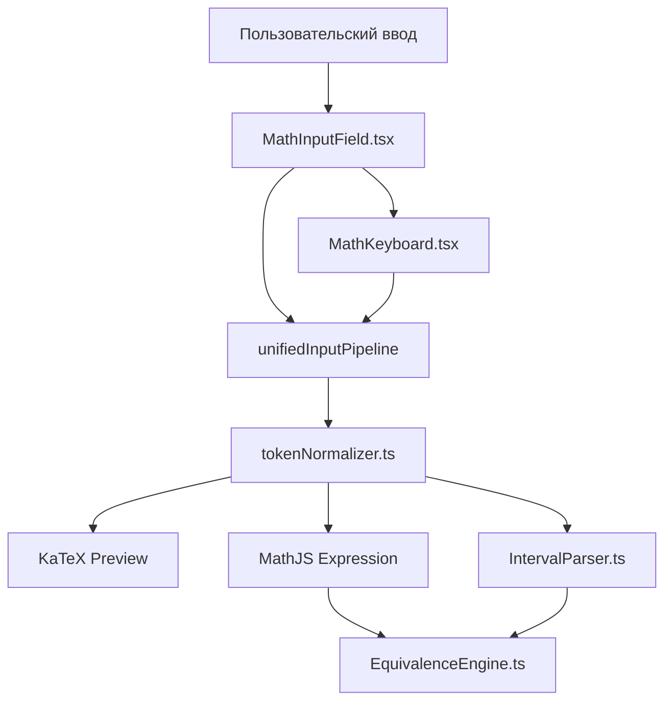

# Design Document: math-input-advanced

## Overview

Расширение системы ввода математических выражений до уровня 9–11 классов. Фича добавляет три новых модуля (`EquivalenceEngine`, `IntervalParser`, `tokenNormalizer`) и расширяет существующие компоненты (`useMathInputLogic.ts`, `MathKeyboard.tsx`).

Ключевые возможности:
- Проверка математической эквивалентности через eval-based стратегию с robust sampling
- Парсинг и сравнение интервальных множеств без MathJS
- Нормализация новых токенов: логарифмы, модули, обратная тригонометрия, степени тригонометрических функций
- Расширенная виртуальная клавиатура с 5-й строкой кнопок

---

## Architecture



Поток данных:
1. Пользователь вводит текст через `MathInputField` (физическая или виртуальная клавиатура)
2. `unifiedInputPipeline` обрабатывает нажатие и обновляет raw value
3. `tokenNormalizer` преобразует raw value в KaTeX (для превью) и MathJS (для вычислений)
4. При проверке ответа `EquivalenceEngine` получает MathJS-строки и сравнивает их
5. Если выражение является `Interval_Set`, `IntervalParser` берёт на себя парсинг и сравнение

---

## Components and Interfaces

### tokenNormalizer.ts (новый файл)

Расширяет логику `normalizeMathExpression` из `useMathInputLogic.ts`. Экспортирует две функции:

```typescript
// Преобразует raw input в KaTeX-строку для превью
function normalizeMathExpression(text: string): string

// Преобразует raw input в MathJS-совместимую строку для вычислений
function toMathJSExpression(text: string): string

// Обратное преобразование: MathJS -> raw input (для Pretty_Printer)
function prettyPrint(mathJSExpr: string): string
```

Маппинг токенов:

| Raw input | KaTeX | MathJS |
|---|---|---|
| `log_2(8)` | `\log_{2}(8)` | `log(8, 2)` |
| `ln(x)` | `\ln(x)` | `log(x)` |
| `lg(x)` | `\lg(x)` | `log(x, 10)` |
| `\|x\|` | `\left\|x\right\|` | `abs(x)` |
| `arcsin(x)` | `\arcsin(x)` | `asin(x)` |
| `arccos(x)` | `\arccos(x)` | `acos(x)` |
| `arctan(x)` | `\arctan(x)` | `atan(x)` |
| `sin^2(x)` | `\sin^{2}(x)` | `(sin(x))^2` |
| `inf` / `+inf` | `\infty` | `Infinity` |
| `-inf` | `-\infty` | `-Infinity` |
| `U` (между интервалами) | `\cup` | (IntervalSet union) |

### EquivalenceEngine.ts (новый файл)

```typescript
interface EquivalenceResult {
  isEquivalent: boolean;
  confidence: number;       // 0-1, доля валидных точек
  validPointsUsed: number;
  error?: string;
}

function checkEquivalence(
  expr1: string,
  expr2: string,
  variables?: string[],
  options?: {
    epsilon?: number;       // default: 1e-9
    minPoints?: number;     // default: 7
    sampleSize?: number;    // default: 20
  }
): EquivalenceResult
```

Стратегия sampling:
- Пул из 20 кандидатов: равномерно из `[-10, 10]` + специальные точки `[0.1, 0.5, 1, 2, 3, Math.E, Math.PI/4]`
- Для каждой точки: try-catch вокруг `math.evaluate`; если NaN/Infinity — пропускаем
- Берём первые 7 валидных точек; если меньше 7 — возвращаем `false` с предупреждением
- Автодетект переменных через regex `[a-zA-Z]+` если `variables` не передан

Ветка Interval_Set: если оба выражения содержат `;` или `U` — делегируем в `IntervalParser.intervalSetsEqual`.

### IntervalParser.ts (новый файл)

```typescript
interface Interval {
  left: number | '-inf';
  right: number | '+inf';
  leftOpen: boolean;    // true = '(', false = '['
  rightOpen: boolean;   // true = ')', false = ']'
}

interface IntervalSet {
  intervals: Interval[];
}

type ParseError = { error: string };

function parseIntervalSet(input: string): IntervalSet | ParseError
function containsPoint(set: IntervalSet, x: number): boolean
function intervalSetsEqual(a: IntervalSet, b: IntervalSet): boolean
function prettyPrintIntervalSet(set: IntervalSet): string
```

Стратегия `intervalSetsEqual`: проверяем принадлежность на 50+ контрольных точках, включая граничные значения `±1e-9` от каждой границы.

### MathKeyboard.tsx (расширение)

Добавляется 5-я строка в `KEYBOARD_LAYOUT`:

```typescript
[
  { label: 'log_()', display: 'log', variant: 'function' },
  { label: 'ln()', display: 'ln', variant: 'function' },
  { label: 'lg()', display: 'lg', variant: 'function' },
  { label: '||', display: '|x|', variant: 'function' },
  { label: 'arcsin()', display: 'arcsin', variant: 'function' },
  { label: 'arccos()', display: 'arccos', variant: 'function' },
  { label: 'arctan()', display: 'arctan', variant: 'function' },
  { label: ' U ', display: '∪', variant: 'operator' },
  { label: ' in ', display: '∈', variant: 'operator' },
  { label: 'inf', display: '∞', variant: 'operator' },
]
```

### useMathInputLogic.ts (расширение)

- `KEYWORDS` расширяется: добавляются `'log_'`, `'ln'`, `'lg'`, `'arcsin'`, `'arccos'`, `'arctan'`
- `processFunctionInput` обрабатывает новые функции: `log_()` (курсор на позицию основания), `||` (курсор внутри)
- `processDelete` обрабатывает атомарное удаление новых ключевых слов

---

## Data Models

### Внутреннее представление выражения

Raw input хранится как plain string в `MathInputField.value`. Нормализация происходит только при рендеринге превью и при передаче в `EquivalenceEngine` — raw value никогда не мутируется.

```
Raw:    "log_2(8) + arcsin(1/2)"
KaTeX:  "\log_{2}(8) + \arcsin(\frac{1}{2})"
MathJS: "log(8, 2) + asin(1/2)"
```

### IntervalSet

```typescript
// "(-inf; -2] U [2; +inf)"
{
  intervals: [
    { left: '-inf', right: -2, leftOpen: true, rightOpen: false },
    { left: 2, right: '+inf', leftOpen: false, rightOpen: true }
  ]
}
```

### EquivalenceResult

```typescript
{
  isEquivalent: true,
  confidence: 1.0,
  validPointsUsed: 7
}
```

---

## Correctness Properties

*A property is a characteristic or behavior that should hold true across all valid executions of a system — essentially, a formal statement about what the system should do. Properties serve as the bridge between human-readable specifications and machine-verifiable correctness guarantees.*

### Property 1: Equivalence correctness

*For any* pair of mathematically equivalent expressions (e.g., `x+y` and `y+x`, `(x-2)*(x+3)` and `x^2+x-6`), `checkEquivalence` should return `isEquivalent: true`.

**Validates: Requirements 1.1, 3.2, 3.3, 3.4**

### Property 2: Minimum valid points

*For any* pair of valid expressions where at least 7 sample points are non-singular, `checkEquivalence` should return `validPointsUsed >= 7`.

**Validates: Requirements 1.2**

### Property 3: Trig power normalization

*For any* trigonometric function `f` in `{sin, cos, tan, cot, sec, csc}` and any integer `n >= 2`, `toMathJSExpression("f^n(x)")` should equal `"(f(x))^n"`.

**Validates: Requirements 2.2, 2.3, 6.4**

### Property 4: Logarithm round-trip

*For any* valid logarithmic expression in raw input form, `prettyPrint(toMathJSExpression(expr))` should produce a string that, when parsed again, yields an equivalent MathJS expression.

**Validates: Requirements 4.4, 4.5**

### Property 5: Absolute value round-trip

*For any* valid expression containing `|expr|`, `prettyPrint(toMathJSExpression(expr))` should produce a string that, when parsed again, yields an equivalent MathJS expression.

**Validates: Requirements 5.2, 5.3**

### Property 6: Trig round-trip

*For any* valid trigonometric expression (including `arcsin`, `arccos`, `arctan`, `sin^n`), `prettyPrint(toMathJSExpression(expr))` should produce a string that, when parsed again, yields an equivalent MathJS expression.

**Validates: Requirements 6.5, 6.6**

### Property 7: Interval parsing correctness

*For any* valid interval string in the form `(a; b)`, `[a; b]`, `(a; b]`, `[a; b)` with finite or infinite bounds, `parseIntervalSet` should return an `IntervalSet` (not a `ParseError`) with correct boundary values and open/closed flags.

**Validates: Requirements 7.1**

### Property 8: Interval equivalence

*For any* two `IntervalSet` objects that represent the same mathematical set (e.g., written in different order or notation), `intervalSetsEqual` should return `true`; for sets that differ on at least one point, it should return `false`.

**Validates: Requirements 7.5**

### Property 9: Interval round-trip

*For any* valid `IntervalSet`, `parseIntervalSet(prettyPrintIntervalSet(set))` should produce an equivalent `IntervalSet`.

**Validates: Requirements 7.6, 7.7**

### Property 10: Token normalization completeness

*For any* expression containing one or more new tokens (`log_a(b)`, `ln`, `lg`, `|expr|`, `arcsin`, `arccos`, `arctan`, `sin^n`, `inf`, `U`), `normalizeMathExpression` should produce a valid KaTeX string and `toMathJSExpression` should produce a valid MathJS string.

**Validates: Requirements 9.1, 9.2**

### Property 11: Backward compatibility

*For any* expression that was valid before this feature (containing `sqrt`, `pi`, `\frac`, `^n`), `normalizeMathExpression` should produce the same output as before.

**Validates: Requirements 9.3**

### Property 12: Parser robustness

*For any* string of length ≤ 500 characters, `normalizeMathExpression` should not throw an exception.

**Validates: Requirements 10.4**

### Property 13: Engine robustness

*For any* pair of strings each of length ≤ 500 characters, `checkEquivalence` should not throw an exception.

**Validates: Requirements 10.5**

---

## Error Handling

| Ситуация | Поведение |
|---|---|
| `log_()` без основания | Возвращает `\log_{\square}(\square)` для KaTeX, не бросает исключение |
| `\|` без закрывающей пары | Стековый алгоритм оставляет незакрытый `\|` как есть, не бросает исключение |
| Интервал с незакрытой скобкой | `parseIntervalSet` возвращает `{ error: "Unclosed bracket at position N" }` |
| MathJS evaluate бросает исключение | try-catch в `checkEquivalence`, точка пропускается |
| Все точки дали NaN/Infinity | `checkEquivalence` возвращает `{ isEquivalent: false, confidence: 0, validPointsUsed: 0, error: "No valid sample points" }` |
| Синтаксически некорректное выражение в движке | `checkEquivalence` возвращает `{ isEquivalent: false, error: "Parse error: ..." }` |
| Пустая строка в нормализаторе | Возвращает `''` |

Все публичные функции трёх новых модулей обёрнуты в try-catch на верхнем уровне — исключения логируются через `console.warn` и не пробрасываются наружу.

---

## Testing Strategy

### Dual Testing Approach

Используются два взаимодополняющих подхода:
- **Unit tests** (Vitest): конкретные примеры, граничные случаи, интеграционные точки
- **Property tests** (fast-check): универсальные свойства на случайных входных данных

### Unit Tests

Файлы:
- `src/lib/math/EquivalenceEngine.test.ts`
- `src/lib/math/IntervalParser.test.ts`
- `src/lib/math/tokenNormalizer.test.ts`

Конкретные примеры для unit-тестов:
- `sin²(x) + cos²(x)` ≡ `1` → `true`
- `sqrt(2)/2` ≡ `1/sqrt(2)` → `true`
- `(x-2)*(x+3)` ≡ `x^2+x-6` → `true`
- `log_2(8)` → KaTeX: `\log_{2}(8)`, MathJS: `log(8, 2)`
- `||` → KaTeX: `\left|\square\right|`
- `||x|-1|` → корректные вложенные границы
- `(-inf; -2] U [2; +inf)` → корректный `IntervalSet`
- `parseIntervalSet("(1; 2")` → `{ error: "..." }`
- `normalizeMathExpression("")` → `""`
- `log_()` → `\log_{\square}(\square)`

### Property Tests (fast-check)

Каждый property test запускается минимум 100 итераций. Каждый тест помечен комментарием:
`// Feature: math-input-advanced, Property N: <property_text>`

```typescript
// Property 12: Parser robustness
// Feature: math-input-advanced, Property 12: normalizeMathExpression не бросает исключение
fc.assert(fc.property(
  fc.string({ maxLength: 500 }),
  (s) => { expect(() => normalizeMathExpression(s)).not.toThrow(); }
), { numRuns: 100 });

// Property 13: Engine robustness
// Feature: math-input-advanced, Property 13: checkEquivalence не бросает исключение
fc.assert(fc.property(
  fc.string({ maxLength: 500 }),
  fc.string({ maxLength: 500 }),
  (a, b) => { expect(() => checkEquivalence(a, b)).not.toThrow(); }
), { numRuns: 100 });

// Property 4: Logarithm round-trip
// Feature: math-input-advanced, Property 4: log round-trip
fc.assert(fc.property(
  fc.integer({ min: 2, max: 10 }).chain(base =>
    fc.integer({ min: 1, max: 100 }).map(arg => `log_${base}(${arg})`)
  ),
  (expr) => {
    const mathjs = toMathJSExpression(expr);
    const back = prettyPrint(mathjs);
    const mathjs2 = toMathJSExpression(back);
    expect(mathjs2).toBe(mathjs);
  }
), { numRuns: 100 });

// Property 9: Interval round-trip
// Feature: math-input-advanced, Property 9: interval round-trip
fc.assert(fc.property(
  intervalSetArbitrary(),
  (set) => {
    const str = prettyPrintIntervalSet(set);
    const parsed = parseIntervalSet(str);
    expect('error' in parsed).toBe(false);
    expect(intervalSetsEqual(set, parsed as IntervalSet)).toBe(true);
  }
), { numRuns: 100 });

// Property 1: Equivalence correctness
// Feature: math-input-advanced, Property 1: equivalent expressions return true
fc.assert(fc.property(
  fc.oneof(
    fc.record({ a: fc.constant('x+y'), b: fc.constant('y+x') }),
    fc.integer({ min: -100, max: 100 }).map(n => ({ a: `${n}`, b: `${n}` }))
  ),
  ({ a, b }) => {
    const result = checkEquivalence(a, b);
    expect(result.isEquivalent).toBe(true);
  }
), { numRuns: 100 });

// Property 3: Trig power normalization
// Feature: math-input-advanced, Property 3: trig^n normalization
fc.assert(fc.property(
  fc.constantFrom('sin', 'cos', 'tan'),
  fc.integer({ min: 2, max: 5 }),
  (fn, n) => {
    const result = toMathJSExpression(`${fn}^${n}(x)`);
    expect(result).toBe(`(${fn}(x))^${n}`);
  }
), { numRuns: 100 });
```

### Библиотека

- Property-based testing: **fast-check** (уже используется в экосистеме, совместим с Vitest)
- Минимум 100 итераций на каждый property test (`numRuns: 100`)
