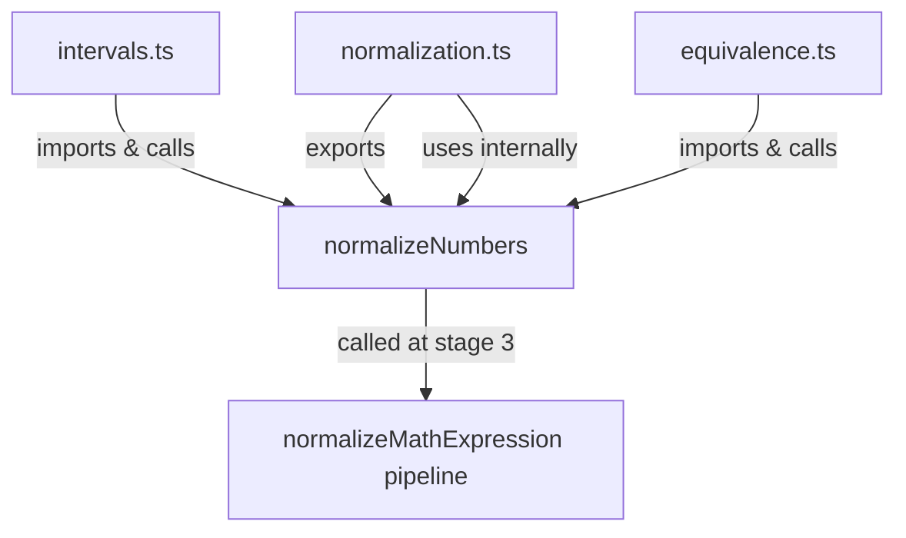

# Design Document: Math Normalization Layer

## Overview

Фича вводит единую функцию `normalizeNumbers` в `src/lib/math/normalization.ts`, которая централизует нормализацию десятичного разделителя и символов бесконечности. Функция встраивается в существующий pipeline `normalizeMathExpression` между `normalizeUnicode` и `normalizeOperators`. Модули `intervals.ts` и `equivalence.ts` перестают содержать собственные inline-замены и делегируют нормализацию в `normalizeNumbers`.

Дополнительно формализуется контракт `normalizeFunctions`: явный комментарий о single-pass гарантии.

Изменения минимальны: не вводится AST, не переписывается `convertFractions`, не добавляются новые публичные функции кроме `normalizeNumbers`.

## Architecture

### Текущее состояние (до фичи)

```
normalizeMathExpression pipeline:
  protectLatex → normalizeUnicode → normalizeOperators → normalizeFunctions
  → convertFractions → normalizeSpacing → restoreLatex

intervals.ts:   inline .replace(/\+∞/g, ...) и т.д.
equivalence.ts: inline .replace(',', '.')
```

### Целевое состояние (после фичи)

```
normalizeMathExpression pipeline:
  protectLatex → normalizeUnicode → [normalizeNumbers] → normalizeOperators
  → normalizeFunctions → convertFractions → normalizeSpacing → restoreLatex

intervals.ts:   вызывает normalizeNumbers(input) перед парсингом
equivalence.ts: вызывает normalizeNumbers(expr) вместо .replace(',', '.')
```

### Диаграмма зависимостей



## Components and Interfaces

### normalizeNumbers (новая функция)

```typescript
/**
 * Normalizes numeric tokens in a math expression:
 *   - DecimalComma: "3,14" → "3.14"
 *   - InfinityVariants: inf, +inf, -inf, ∞, +∞, -∞ → Infinity / -Infinity
 *
 * Does NOT modify IntervalSyntaxChars (;, (, ), [, ]).
 * Intended to run on unprotected text (between protectLatex and restoreLatex).
 *
 * @param input Raw math expression string (no LaTeX placeholders).
 * @returns Normalized string.
 */
export function normalizeNumbers(input: string): string
```

**Контракт:**
- Идемпотентна: `normalizeNumbers(normalizeNumbers(x)) === normalizeNumbers(x)`
- Не трогает `IntervalSyntaxChars`: `;`, `(`, `)`, `[`, `]`
- Не трогает `LatexProtectedZone` (вызывается только на незащищённом тексте)
- Если нет `DecimalComma` и `InfinityVariant` — возвращает строку без изменений

### Изменения в normalizeMathExpression

Добавляется вызов `normalizeNumbers` как этап 3 (после `normalizeUnicode`, до `normalizeOperators`):

```typescript
state = protectLatex(state);
state = normalizeUnicode(state);
state = normalizeNumbers(state);   // ← новый этап
state = normalizeOperators(state);
state = normalizeFunctions(state);
state = convertFractionsStage(state);
state = normalizeSpacing(state);
state = restoreLatex(state);
```

Внутри pipeline `normalizeNumbers` оборачивается в stage-адаптер аналогично другим этапам.

### Изменения в normalizeFunctions

Добавляется явный комментарий о single-pass контракте:

```typescript
/**
 * Converts sqrt() → \sqrt{} for KaTeX (single pass, innermost first).
 * Also handles log/ln/lg → LaTeX equivalents.
 *
 * Single pass — no loops, no recursion. Each pattern is applied once.
 */
```

### Изменения в intervals.ts

`parseIntervalSet` вызывает `normalizeNumbers` в начале, inline-замены удаляются:

```typescript
import { normalizeNumbers } from '../math/normalization';

export function parseIntervalSet(input: string): IntervalSet {
  const normalized = normalizeNumbers(input);
  // ... остальная логика без inline replace для infinity
}
```

### Изменения в equivalence.ts

`compareExpressions` вызывает `normalizeNumbers` вместо inline `.replace`:

```typescript
import { normalizeNumbers } from '../math/normalization';

export function compareExpressions(expr1: string, expr2: string): boolean {
  const e1 = normalizeNumbers(expr1);
  const e2 = normalizeNumbers(expr2);
  const result = checkEquivalence(e1, e2);
  return result.isEquivalent && result.confidence >= 0.99;
}
```

## Data Models

Новых типов данных не вводится. Функция `normalizeNumbers` работает со строками `string → string`.

Существующие типы `BoundaryValue`, `IntervalBoundary`, `Interval`, `IntervalSet` в `intervals.ts` остаются без изменений.

### Маппинг InfinityVariant → CanonicalInfinity

| Входная форма | Канонический вид |
|---|---|
| `inf` (без знака) | `Infinity` |
| `+inf` | `Infinity` |
| `-inf` | `-Infinity` |
| `∞` | `Infinity` |
| `+∞` | `Infinity` |
| `-∞` | `-Infinity` |

### Маппинг DecimalComma

| Входная форма | Канонический вид |
|---|---|
| `3,14` | `3.14` |
| `-0,5` | `-0.5` |

Замена `,` → `.` применяется только между цифрами (паттерн `(\d),(\d)`), чтобы не затронуть `;` и другие разделители.


## Correctness Properties

*A property is a characteristic or behavior that should hold true across all valid executions of a system — essentially, a formal statement about what the system should do. Properties serve as the bridge between human-readable specifications and machine-verifiable correctness guarantees.*

### Property 1: DecimalComma конвертируется в точку

*For any* строки, содержащей цифры, разделённые запятой как десятичным разделителем (например `"3,14"`), `normalizeNumbers` должна вернуть строку, в которой эта запятая заменена на точку (`"3.14"`), и результат должен быть корректно вычислим как число.

**Validates: Requirements 1.1**

### Property 2: Все формы InfinityVariant конвертируются в CanonicalInfinity

*For any* выражения, содержащего любую из форм `inf`, `+inf`, `-inf`, `∞`, `+∞`, `-∞`, `normalizeNumbers` должна вернуть строку, в которой эта форма заменена на `Infinity` или `-Infinity` соответственно, и результат не должен содержать исходную форму.

**Validates: Requirements 1.2**

### Property 3: normalizeNumbers идемпотентна

*For any* входной строки, применение `normalizeNumbers` дважды должно давать тот же результат, что и применение один раз: `normalizeNumbers(normalizeNumbers(x)) === normalizeNumbers(x)`.

**Validates: Requirements 1.5**

### Property 4: IntervalSyntaxChars не изменяются

*For any* строки, содержащей символы `;`, `(`, `)`, `[`, `]`, количество каждого из этих символов в выходе `normalizeNumbers` должно быть равно их количеству во входе.

**Validates: Requirements 1.7**

### Property 5: LaTeX-плейсхолдеры не изменяются

*For any* строки, содержащей плейсхолдеры вида `\x00LATEXn\x00`, `normalizeNumbers` должна вернуть строку, в которой все такие плейсхолдеры присутствуют без изменений.

**Validates: Requirements 1.6**

### Property 6: parseIntervalSet эквивалентен для всех форм бесконечности

*For any* интервального выражения, содержащего любую форму `InfinityVariant`, `parseIntervalSet` должна вернуть тот же `IntervalSet`, что и при передаче эквивалентного выражения с `CanonicalInfinity` (`Infinity` / `-Infinity`).

**Validates: Requirements 3.1, 3.3**

### Property 7: compareExpressions корректно обрабатывает DecimalComma

*For any* пары математически эквивалентных выражений, где одно содержит `DecimalComma` (например `"3,14"`), а другое — десятичную точку (`"3.14"`), `compareExpressions` должна вернуть `true`.

**Validates: Requirements 4.1, 4.3**

### Property 8: normalizeFunctions идемпотентна

*For any* математического выражения, содержащего вызовы `sqrt`, `log`, `ln`, `lg`, применение `normalizeFunctions` дважды должно давать тот же результат, что и применение один раз.

**Validates: Requirements 5.1, 5.3**

## Error Handling

`normalizeNumbers` — чистая строковая функция без side-effects. Обработка ошибок минимальна:

- Если `input` не является строкой или равен `null`/`undefined` — возвращается пустая строка (аналогично другим функциям в `normalization.ts`).
- Функция не бросает исключений при любом строковом вводе.

`intervals.ts` и `equivalence.ts` не меняют своей обработки ошибок — они просто делегируют нормализацию раньше, чем раньше.

## Testing Strategy

### Подход

Используется двойная стратегия: unit-тесты для конкретных примеров и edge-cases, property-based тесты для универсальных свойств.

**Property-based testing библиотека:** `fast-check` (уже используется в экосистеме TypeScript/Vitest).

### Unit-тесты (конкретные примеры)

Файл: `src/lib/math/normalization.test.ts` (или рядом с модулем)

- `normalizeNumbers("3,14")` → `"3.14"`
- `normalizeNumbers("∞")` → `"Infinity"`
- `normalizeNumbers("-∞")` → `"-Infinity"`
- `normalizeNumbers("+inf")` → `"Infinity"`
- `normalizeNumbers("-inf")` → `"-Infinity"`
- `normalizeNumbers("(-∞; 5]")` → `"(-Infinity; 5]"` (IntervalSyntaxChars сохранены)
- `normalizeNumbers("x + 1")` → `"x + 1"` (no-op)
- `parseIntervalSet("(-∞; 5]")` эквивалентен `parseIntervalSet("(-Infinity; 5]")` (example из Req 3.3)
- `compareExpressions("3,14", "3.14")` → `true`

### Property-based тесты

Конфигурация: минимум 100 итераций на каждый тест (`fc.assert(..., { numRuns: 100 })`).

Каждый тест помечается комментарием:
`// Feature: math-normalization-layer, Property N: <text>`

**Property 1 — DecimalComma конвертируется:**
```typescript
// Feature: math-normalization-layer, Property 1: DecimalComma converts to decimal point
fc.assert(fc.property(
  fc.integer({ min: 0, max: 999 }),
  fc.integer({ min: 0, max: 999 }),
  (a, b) => {
    const input = `${a},${b}`;
    const result = normalizeNumbers(input);
    return result === `${a}.${b}`;
  }
), { numRuns: 100 });
```

**Property 2 — InfinityVariant конвертируется:**
```typescript
// Feature: math-normalization-layer, Property 2: InfinityVariant converts to CanonicalInfinity
fc.assert(fc.property(
  fc.constantFrom('inf', '+inf', '-inf', '∞', '+∞', '-∞'),
  fc.string(),
  (variant, prefix) => {
    const result = normalizeNumbers(prefix + variant);
    return result.includes('Infinity') && !result.includes(variant);
  }
), { numRuns: 100 });
```

**Property 3 — Идемпотентность normalizeNumbers:**
```typescript
// Feature: math-normalization-layer, Property 3: normalizeNumbers is idempotent
fc.assert(fc.property(
  fc.string(),
  (s) => normalizeNumbers(normalizeNumbers(s)) === normalizeNumbers(s)
), { numRuns: 100 });
```

**Property 4 — IntervalSyntaxChars не изменяются:**
```typescript
// Feature: math-normalization-layer, Property 4: IntervalSyntaxChars are preserved
const syntaxChars = [';', '(', ')', '[', ']'];
fc.assert(fc.property(
  fc.string(),
  (s) => syntaxChars.every(ch =>
    (s.split(ch).length - 1) === (normalizeNumbers(s).split(ch).length - 1)
  )
), { numRuns: 100 });
```

**Property 5 — LaTeX-плейсхолдеры не изменяются:**
```typescript
// Feature: math-normalization-layer, Property 5: LaTeX placeholders are preserved
fc.assert(fc.property(
  fc.nat(10),
  fc.string(),
  (idx, surrounding) => {
    const placeholder = `\x00LATEX${idx}\x00`;
    const input = surrounding + placeholder + surrounding;
    return normalizeNumbers(input).includes(placeholder);
  }
), { numRuns: 100 });
```

**Property 6 — parseIntervalSet эквивалентен для InfinityVariant:**
```typescript
// Feature: math-normalization-layer, Property 6: parseIntervalSet equivalent for all InfinityVariant forms
fc.assert(fc.property(
  fc.constantFrom('-∞', '-inf', '-Inf'),
  fc.integer({ min: 1, max: 100 }),
  fc.constantFrom(']', ')'),
  (negInf, bound, bracket) => {
    const withVariant = `(${negInf}; ${bound}${bracket}`;
    const withCanonical = `(-Infinity; ${bound}${bracket}`;
    return JSON.stringify(parseIntervalSet(withVariant)) ===
           JSON.stringify(parseIntervalSet(withCanonical));
  }
), { numRuns: 100 });
```

**Property 7 — compareExpressions с DecimalComma:**
```typescript
// Feature: math-normalization-layer, Property 7: compareExpressions handles DecimalComma
fc.assert(fc.property(
  fc.integer({ min: 1, max: 999 }),
  fc.integer({ min: 0, max: 999 }),
  (a, b) => {
    const withComma = `${a},${b}`;
    const withDot = `${a}.${b}`;
    return compareExpressions(withComma, withDot) === true;
  }
), { numRuns: 100 });
```

**Property 8 — normalizeFunctions идемпотентна:**
```typescript
// Feature: math-normalization-layer, Property 8: normalizeFunctions is idempotent
fc.assert(fc.property(
  fc.string(),
  (s) => {
    const once = normalizeMathExpression(s);
    // normalizeFunctions is internal; idempotency tested via full pipeline
    return normalizeMathExpression(once) === once;
  }
), { numRuns: 100 });
```

### Баланс тестов

- Unit-тесты покрывают конкретные примеры, граничные случаи и интеграционные точки.
- Property-тесты верифицируют универсальные инварианты на широком диапазоне входов.
- Существующие тесты (`MathInput.test.ts`, `MathInput.fraction.test.ts`) не должны изменить поведение — это верифицируется запуском тест-сьюта после изменений.
