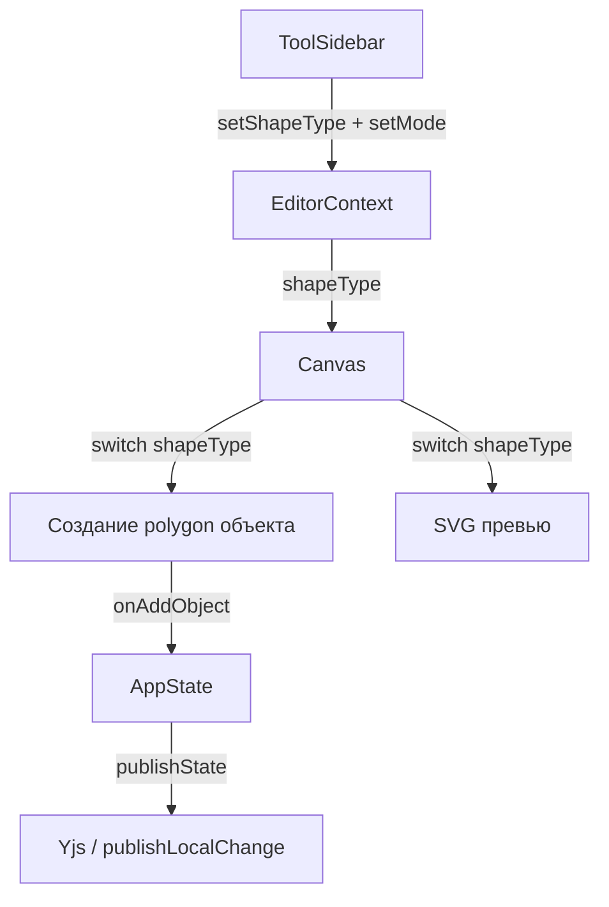

# Design Document: Shape Tool Expansion

## Overview

Расширение инструмента рисования фигур тремя новыми полигональными фигурами: трапецией, ромбом и параллелограммом. Все три реализуются через существующий тип объекта `polygon` с нормализованными точками — тот же механизм, что уже используется для пятиугольника. Дополнительно фиксируется поведение кнопки «Очистить доску» в TopBar (уже реализована) и исправление ввода стилуса на планшете GPX 3010.

Изменения минимальны и хирургически точны: расширяется тип `ShapeType` в `EditorContext`, добавляются три `case` в `switch` в `Canvas.tsx` (создание объекта + превью), добавляются три кнопки в `ToolSidebar.tsx`.

## Architecture



Поток данных не меняется. Новые фигуры проходят тот же путь, что и существующий `polygon` (пятиугольник): `ToolSidebar` → `EditorContext.shapeType` → `Canvas` switch → `polygon` объект → `AppState` → `publishState`.

## Components and Interfaces

### EditorContext (`src/contexts/EditorContext.tsx`)

Текущий тип `ShapeType` (инлайн в интерфейсе):
```ts
'rectangle' | 'circle' | 'triangle' | 'polygon' | 'geoshape-circle' | 'geoshape-triangle' | 'geoshape-quad'
```

После изменения:
```ts
'rectangle' | 'circle' | 'triangle' | 'polygon' | 'trapezoid' | 'rhombus' | 'parallelogram'
  | 'geoshape-circle' | 'geoshape-triangle' | 'geoshape-quad'
```

Тип обновляется в двух местах: в `EditorContextValue` (интерфейс) и в `useState` (реализация). Экспортируемый тип `ShapeType` не объявлен отдельно — он инлайн, поэтому достаточно обновить оба места.

### Canvas.tsx (`src/components/Canvas.tsx`)

**Создание объекта** — в `handleCanvasPointerUp`, в `switch (shapeType)`, добавляются три новых `case`:

```ts
case 'trapezoid': {
  const points = [{ x: 0.2, y: 0 }, { x: 0.8, y: 0 }, { x: 1, y: 1 }, { x: 0, y: 1 }];
  newShape = { id, type: 'polygon', x: sx, y: sy, width: w, height: h, rotation: 0,
    opacity: 1, visible: true, locked: false,
    data: { points, fill: '#F59E0B', stroke: '#D97706', strokeWidth: 2 } };
  break;
}
case 'rhombus': {
  const points = [{ x: 0.5, y: 0 }, { x: 1, y: 0.5 }, { x: 0.5, y: 1 }, { x: 0, y: 0.5 }];
  newShape = { id, type: 'polygon', x: sx, y: sy, width: w, height: h, rotation: 0,
    opacity: 1, visible: true, locked: false,
    data: { points, fill: '#F59E0B', stroke: '#D97706', strokeWidth: 2 } };
  break;
}
case 'parallelogram': {
  const points = [{ x: 0.25, y: 0 }, { x: 1, y: 0 }, { x: 0.75, y: 1 }, { x: 0, y: 1 }];
  newShape = { id, type: 'polygon', x: sx, y: sy, width: w, height: h, rotation: 0,
    opacity: 1, visible: true, locked: false,
    data: { points, fill: '#F59E0B', stroke: '#D97706', strokeWidth: 2 } };
  break;
}
```

**Превью** — в inline IIFE рендера превью (`isDrawingShape && shapeDrawStart && shapeDrawEnd`), добавляются три ветки перед `return <rect .../>`:

```ts
if (shapeType === 'trapezoid') {
  const pts = [[x + w*0.2, y], [x + w*0.8, y], [x + w, y + h], [x, y + h]]
    .map(([px, py]) => `${px},${py}`).join(' ');
  return <polygon points={pts} {...p} />;
}
if (shapeType === 'rhombus') {
  const pts = [[x + w*0.5, y], [x + w, y + h*0.5], [x + w*0.5, y + h], [x, y + h*0.5]]
    .map(([px, py]) => `${px},${py}`).join(' ');
  return <polygon points={pts} {...p} />;
}
if (shapeType === 'parallelogram') {
  const pts = [[x + w*0.25, y], [x + w, y], [x + w*0.75, y + h], [x, y + h]]
    .map(([px, py]) => `${px},${py}`).join(' ');
  return <polygon points={pts} {...p} />;
}
```

**Исправление стилуса (GPX 3010)** — в `handleCanvasPointerDown` текущая проверка:
```ts
const isDrawingInput =
  e.pointerType === 'pen' ||
  e.pointerType === 'touch' ||
  (e.pointerType === 'mouse' && e.button === 0);
```
Уже корректно обрабатывает `pointerType === 'pen'` независимо от `e.button`. Дополнительно нужно убедиться, что условие не блокирует `pen` при `e.button !== 0` (некоторые стилусы на GPX 3010 могут репортить `button = -1` при hover). Исправление: вынести `pen` первым и не добавлять проверку `button` для него — что уже сделано. Если проблема воспроизводится, нужно добавить логирование `e.button` для `pen` событий.

### ToolSidebar.tsx (`src/components/ToolSidebar.tsx`)

В `TOOL_GROUPS`, в группе `'shapes'`, добавляются три новых `ToolDef`:

```ts
{ id: 'shape-trapezoid',     name: 'Трапеция',        icon: Pentagon, mode: 'shape' },
{ id: 'shape-rhombus',       name: 'Ромб',             icon: Pentagon, mode: 'shape' },
{ id: 'shape-parallelogram', name: 'Параллелограмм',   icon: Pentagon, mode: 'shape' },
```

В `shapeToolToType` добавляются три маппинга:
```ts
'shape-trapezoid':     'trapezoid',
'shape-rhombus':       'rhombus',
'shape-parallelogram': 'parallelogram',
```

> Примечание: `lucide-react` не содержит иконок для трапеции/ромба/параллелограмма. Используется `Pentagon` как ближайший полигональный вариант, аналогично существующему `shape-geo-quad`. При необходимости можно заменить на кастомные SVG-иконки.

### TopBar.tsx (`src/components/TopBar.tsx`)

Кнопка «Очистить доску» уже реализована (строки 125–130). Поведение соответствует требованиям:
- Видима только при `roomState.role === 'teacher'`
- Вызывает `clearBoard()` + `publishLocalChange(getCanvasSnapshot())`
- Иконка `Trash2` из `lucide-react`

Изменений не требуется.

## Data Models

### AnyCanvasObject — тип `polygon`

Новые фигуры используют существующую структуру без изменений:

```ts
{
  id: string,
  type: 'polygon',
  x: number,       // левый верхний угол bounding box
  y: number,
  width: number,
  height: number,
  rotation: 0,
  opacity: 1,
  visible: true,
  locked: false,
  data: {
    points: Array<{ x: number; y: number }>,  // нормализованные [0,1]
    fill: '#F59E0B',
    stroke: '#D97706',
    strokeWidth: 2,
  }
}
```

`ObjectRenderer` уже умеет рендерить `polygon` — масштабирует нормализованные точки до реального bounding box:
```ts
const pts = d.points.map(p => `${x + p.x * obj.width},${y + p.y * obj.height}`).join(' ');
```

### Нормализованные точки новых фигур

| Фигура | points |
|--------|--------|
| trapezoid | `[{x:0.2,y:0},{x:0.8,y:0},{x:1,y:1},{x:0,y:1}]` |
| rhombus | `[{x:0.5,y:0},{x:1,y:0.5},{x:0.5,y:1},{x:0,y:0.5}]` |
| parallelogram | `[{x:0.25,y:0},{x:1,y:0},{x:0.75,y:1},{x:0,y:1}]` |

### Синхронизация (Yjs)

Новые объекты типа `polygon` попадают в `publishState()` → `publishLocalChange(getCanvasSnapshot())` — тот же путь, что и все остальные объекты. Никаких изменений в `useYjsSync.ts` или `SupabaseProvider.ts` не требуется: Yjs сериализует `AnyCanvasObject[]` целиком, тип `polygon` уже поддерживается.

## Correctness Properties

*A property is a characteristic or behavior that should hold true across all valid executions of a system — essentially, a formal statement about what the system should do. Properties serve as the bridge between human-readable specifications and machine-verifiable correctness guarantees.*

### Property 1: Нормализованные точки новых фигур корректны

*For any* нового объекта типа `polygon`, созданного при `shapeType ∈ {trapezoid, rhombus, parallelogram}`, все точки в `data.points` должны иметь координаты `x ∈ [0, 1]` и `y ∈ [0, 1]`.

**Validates: Requirements 2.1, 2.2, 2.3**

---

### Property 2: Создание фигуры — round trip через тип

*For any* значения `shapeType ∈ {trapezoid, rhombus, parallelogram}` и любого bounding box с `w > 5` и `h > 5`, созданный объект должен иметь `type === 'polygon'` и `data.points` равные эталонным нормализованным точкам для данного `shapeType`.

**Validates: Requirements 2.1, 2.2, 2.3**

---

### Property 3: Превью соответствует финальной фигуре

*For any* `shapeType ∈ {trapezoid, rhombus, parallelogram}` и любого bounding box `(x, y, w, h)`, точки SVG-полигона в превью должны быть вычислены из тех же нормализованных точек, что и финальный объект, масштабированных до `(w, h)`.

**Validates: Requirements 3.1, 3.2, 3.3**

---

### Property 4: Стиль новых фигур совпадает с пятиугольником

*For any* нового объекта `polygon`, созданного через shape tool, `data.fill === '#F59E0B'`, `data.stroke === '#D97706'`, `data.strokeWidth === 2`.

**Validates: Requirements 2.4**

---

### Property 5: ShapeType принимает новые литералы без ошибок

*For any* значения из `{trapezoid, rhombus, parallelogram}`, вызов `setShapeType(value)` должен сохранять это значение в состоянии контекста без TypeScript-ошибок и без изменения на дефолтное.

**Validates: Requirements 1.1, 1.2, 1.3**

---

### Property 6: Кнопки toolbar вызывают правильный shapeType

*For any* кнопки `{shape-trapezoid, shape-rhombus, shape-parallelogram}`, нажатие должно устанавливать соответствующий `shapeType` и `mode === 'shape'`.

**Validates: Requirements 4.1, 4.2, 4.3, 4.4**

## Error Handling

**Минимальный bounding box**: Если `w <= 5` или `h <= 5`, объект не создаётся — существующая проверка `if (w > 5 && h > 5)` покрывает все новые фигуры без изменений.

**Неизвестный shapeType**: `default` ветка в `switch` создаёт прямоугольник — безопасный fallback, не изменяется.

**Стилус GPX 3010**: Если `pointerType === 'pen'` и `button !== 0` (hover или side button), текущая логика уже пропускает `pen` без проверки `button`. Если проблема воспроизводится — добавить `console.log('[canvas] pen button:', e.button)` для диагностики перед релизом.

**Синхронизация**: `publishState()` вызывается после `onAddObject` в существующем коде — новые фигуры автоматически попадают в Yjs без дополнительной обработки.

## Testing Strategy

### Unit-тесты (примеры и граничные случаи)

- Проверить, что `shapeType === 'trapezoid'` создаёт `polygon` с точками `[{x:0.2,y:0},...]`
- Проверить, что `shapeType === 'rhombus'` создаёт `polygon` с точками `[{x:0.5,y:0},...]`
- Проверить, что `shapeType === 'parallelogram'` создаёт `polygon` с точками `[{x:0.25,y:0},...]`
- Граничный случай: bounding box `5×5` — объект не создаётся; `6×6` — создаётся
- Проверить, что `setShapeType('trapezoid')` не вызывает TypeScript-ошибок (статическая проверка)

### Property-тесты (fast-check)

Используется библиотека **fast-check** (уже в стеке проекта как dev-зависимость через Vitest).

Каждый тест запускается минимум **100 итераций**.

```ts
// Feature: shape-tool-expansion, Property 2: Создание фигуры — round trip через тип
fc.assert(fc.property(
  fc.constantFrom('trapezoid', 'rhombus', 'parallelogram'),
  fc.integer({ min: 6, max: 500 }),
  fc.integer({ min: 6, max: 500 }),
  (shapeType, w, h) => {
    const obj = createShapeObject(shapeType, 0, 0, w, h);
    expect(obj.type).toBe('polygon');
    expect(obj.data.points).toEqual(EXPECTED_POINTS[shapeType]);
  }
), { numRuns: 100 });

// Feature: shape-tool-expansion, Property 1: Нормализованные точки корректны
fc.assert(fc.property(
  fc.constantFrom('trapezoid', 'rhombus', 'parallelogram'),
  (shapeType) => {
    const points = SHAPE_POINTS[shapeType];
    points.forEach(p => {
      expect(p.x).toBeGreaterThanOrEqual(0);
      expect(p.x).toBeLessThanOrEqual(1);
      expect(p.y).toBeGreaterThanOrEqual(0);
      expect(p.y).toBeLessThanOrEqual(1);
    });
  }
), { numRuns: 100 });

// Feature: shape-tool-expansion, Property 3: Превью соответствует финальной фигуре
fc.assert(fc.property(
  fc.constantFrom('trapezoid', 'rhombus', 'parallelogram'),
  fc.integer({ min: 10, max: 800 }),
  fc.integer({ min: 10, max: 800 }),
  fc.integer({ min: 10, max: 800 }),
  fc.integer({ min: 10, max: 800 }),
  (shapeType, x, y, w, h) => {
    const previewPts = computePreviewPoints(shapeType, x, y, w, h);
    const objPts = SHAPE_POINTS[shapeType].map(p => ({ x: x + p.x * w, y: y + p.y * h }));
    expect(previewPts).toEqual(objPts);
  }
), { numRuns: 100 });
```

Тег формата: `Feature: shape-tool-expansion, Property {N}: {property_text}`

Каждое свойство реализуется одним property-тестом. Unit-тесты дополняют их для конкретных примеров и граничных случаев.
