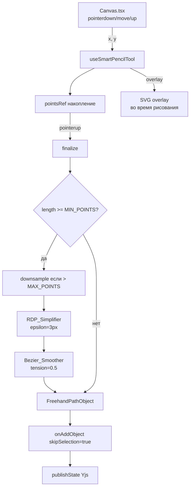

# Design Document: Умный карандаш (Smart Pencil)

## Overview

Инструмент «Умный карандаш» — новый режим рисования на Canvas, который собирает точки штриха в реальном времени, а после завершения (`pointerup`) автоматически применяет pipeline улучшения: упрощение алгоритмом Ramer–Douglas–Peucker (RDP) и сглаживание квадратичными кривыми Безье. Результат сохраняется как стандартный `FreehandPathObject` (`type: 'freehand'`), полностью совместимый с undo/redo, коллаборацией и панелью свойств.

Архитектурно инструмент повторяет паттерн `useFreehandTool` / `useHighlighterTool`: изолированный хук + интеграция в `Canvas.tsx` через единый блок `if (mode === ...)`. Новых зависимостей не добавляется.

---

## Architecture



**Поток данных:**
1. `Canvas.tsx` перехватывает pointer-события и делегирует их хуку
2. Хук накапливает точки в `pointsRef` (без перерендеров)
3. При `pointerup` → `finalize()` запускает pipeline и создаёт объект
4. Overlay отображается через React state только для визуальной обратной связи

---

## Components and Interfaces

### useSmartPencilTool (новый файл)

**Путь:** `src/components/canvas/tools/useSmartPencilTool.ts`

```typescript
// Константы pipeline
const SMOOTHING_TENSION = 0.5;
const MIN_POINTS = 3;
const RDP_EPSILON = 3;       // пикселей
const MAX_POINTS = 2000;

interface UseSmartPencilToolOptions {
    penSettings: { width: number; color: string };
    onAddObject: (obj: AnyCanvasObject, skipSelection?: boolean) => void;
    publishState: () => void;
    mode: string;
}

export interface SmartPencilOverlay {
    points: { x: number; y: number }[];
    color: string;
    width: number;
}

// Возвращаемый интерфейс (идентичен useFreehandTool)
export function useSmartPencilTool(options: UseSmartPencilToolOptions): {
    isDrawing: boolean;
    isDrawingRef: React.MutableRefObject<boolean>;
    onMouseDown: (x: number, y: number) => void;
    onMouseMove: (x: number, y: number) => void;
    onMouseUp: () => void;
    onCancel: () => void;
    overlay: SmartPencilOverlay | null;
}
```

### rdpSimplify (вспомогательная функция внутри хука)

```typescript
function rdpSimplify(
    points: { x: number; y: number }[],
    epsilon: number
): { x: number; y: number }[]
```

Алгоритм Ramer–Douglas–Peucker: рекурсивно находит точку с максимальным перпендикулярным отклонением от прямой между первой и последней точками. Если отклонение > epsilon — точка сохраняется, иначе промежуточные точки отбрасываются.

### chaikinSmooth (вспомогательная функция внутри хука)

```typescript
function chaikinSmooth(
    points: { x: number; y: number }[],
    iterations: number
): { x: number; y: number }[]
```

Реализует алгоритм Chaikin corner-cutting: на каждой итерации каждый сегмент заменяется двумя точками на 25% и 75% от его длины. Простой, стабильный, не требует вычисления контрольных точек. Возвращает `{x,y}[]` — **не SVG-строку**, совместимо с существующим рендерером `FreehandPathObject`.

> Не использовать "настоящие" кривые Безье — только corner-cutting или moving average.

### Изменения в существующих файлах

| Файл | Изменение |
|------|-----------|
| `src/lib/types.ts` | Добавить `'smart-pencil'` в `AppMode` |
| `src/components/Canvas.tsx` | Импорт и инициализация `useSmartPencilTool`; обработка событий; overlay; курсор; блокировка drag/resize |
| `src/components/ToolSidebar.tsx` | Добавить кнопку `PencilLine` в группу `freehand` |
| `src/components/properties/PropertiesPanel.tsx` | Добавить `mode === 'smart-pencil'` → `<PenSettingsPanel>` |
| `src/App.tsx` | Добавить `'smart-pencil'` в условие видимости `PropertiesPanel` |

---

## Data Models

Smart Pencil не вводит новых типов объектов. Созданный объект — стандартный `FreehandPathObject`:

```typescript
interface FreehandPathObject extends CanvasObject {
    type: 'freehand';           // существующий тип
    data: {
        points: { x: number; y: number }[];  // улучшенные точки после pipeline
        color: string;
        width: number;
    };
}
```

**Bounding box** вычисляется из улучшенных точек:
- `x = min(points[i].x)`, `y = min(points[i].y)`
- `width = max(1, max(x) - min(x))`, `height = max(1, max(y) - min(y))`

**Pipeline downsample** (при `length > MAX_POINTS`):
```
step = Math.ceil(length / MAX_POINTS)
downsampled = points.filter((_, i) => i % step === 0)
// Всегда включать последнюю точку для сохранения конца штриха
```

**Overlay vs финальный stroke:** overlay отображает сырые точки во время рисования, финальный объект содержит улучшенные точки. "Перескок" при финализации — ожидаемое поведение MVP. Overlay обязательно сбрасывается в `null` до вызова `onAddObject`.

**Bounding box** вычисляется из улучшенных точек (после pipeline), не из исходных. Smoothing может незначительно выйти за границы исходного stroke — это допустимо.

---

## Correctness Properties

*A property is a characteristic or behavior that should hold true across all valid executions of a system — essentially, a formal statement about what the system should do. Properties serve as the bridge between human-readable specifications and machine-verifiable correctness guarantees.*

### Property 1: onMouseDown активирует рисование

*For any* координат `(x, y)`, после вызова `onMouseDown(x, y)` хук должен находиться в состоянии рисования (`isDrawing === true`) и `overlay` должен содержать точку `{x, y}`.

**Validates: Requirements 1.4**

---

### Property 2: Порог добавления точек 2px

*For any* последовательности вызовов `onMouseMove`, точка добавляется в накопленный список только если расстояние от предыдущей точки превышает 2px. Точки ближе 2px игнорируются.

**Validates: Requirements 1.5**

---

### Property 3: Cancel не создаёт объект

*For any* состояния рисования (любое количество накопленных точек), вызов `onCancel()` должен сбросить `isDrawing` в `false`, установить `overlay` в `null` и не вызывать `onAddObject`.

**Validates: Requirements 1.6**

---

### Property 4: Abort при смене режима

*For any* активного штриха, если `mode` изменяется на значение, отличное от `'smart-pencil'`, хук должен автоматически прервать рисование без создания объекта.

**Validates: Requirements 1.7**

---

### Property 5: RDP возвращает подмножество входных точек

*For any* массива точек и значения `epsilon > 0`, результат `rdpSimplify` должен быть подмножеством входного массива (RDP не создаёт новых точек, только удаляет лишние).

**Validates: Requirements 2.1**

---

### Property 6: Bezier_Smoother возвращает {x,y}[]

*For any* массива точек и значения `tension`, результат `bezierSmooth` должен быть массивом объектов с числовыми полями `x` и `y` — не строкой и не SVG-командами.

**Validates: Requirements 2.2, 2.11**

---

### Property 7: Pipeline применяется при достаточном числе точек

*For any* набора точек длиной >= `MIN_POINTS`, после `finalize()` созданный объект должен содержать точки, прошедшие через RDP и Bezier pipeline (т.е. потенциально отличающиеся от исходных). При длине < `MIN_POINTS` — исходные точки используются без изменений.

**Validates: Requirements 2.3, 2.4**

---

### Property 8: Pipeline всегда возвращает >= 2 точек

*For any* входного массива точек (включая вырожденные случаи: коллинеарные точки, большой epsilon), результат полного pipeline должен содержать не менее 2 точек.

**Validates: Requirements 2.5, 2.8**

---

### Property 9: Downsample при превышении MAX_POINTS

*For any* массива точек длиной > `MAX_POINTS`, перед передачей в `rdpSimplify` количество точек должно быть сокращено до <= `MAX_POINTS`.

**Validates: Requirements 2.10**

---

### Property 10: Созданный объект имеет type 'freehand'

*For any* завершённого штриха (>= 1 точки), `onAddObject` должен быть вызван с объектом, у которого `type === 'freehand'` и `data.points` является массивом `{x,y}[]`.

**Validates: Requirements 3.1**

---

### Property 11: skipSelection всегда true

*For any* завершённого штриха, `onAddObject` должен вызываться со вторым аргументом `true` (skipSelection).

**Validates: Requirements 3.2**

---

### Property 12: Bounding box >= 1

*For any* набора улучшенных точек, вычисленные `width` и `height` объекта должны быть >= 1.

**Validates: Requirements 3.5**

---

### Property 13: Состояние сбрасывается до onAddObject

*For any* завершённого штриха, в момент вызова `onAddObject` хук уже должен находиться в состоянии `isDrawing === false` и `overlay === null`.

**Validates: Requirements 3.7**

---

## Error Handling

| Ситуация | Поведение |
|----------|-----------|
| `pointercancel` во время рисования | `onCancel()` → abort без создания объекта |
| Смена инструмента mid-stroke | `useEffect` на `mode` → `abort()` |
| RDP возвращает < 2 точек | Fallback: `[points[0], points[points.length - 1]]` |
| Одна точка (tap) | Дублируется: `[pt, {...pt}]` → dot через `strokeLinecap="round"` |
| `pointsRef.current.length === 0` при finalize | Ранний выход, объект не создаётся |
| `> MAX_POINTS` точек | `step = Math.ceil(length / MAX_POINTS)`, `filter((_, i) => i % step === 0)`, последняя точка включается |
| Микроштрих (totalLength < 2px) | Treat as dot: дублировать единственную точку |

---

## Testing Strategy

### Unit-тесты (конкретные примеры и edge-cases)

- `rdpSimplify` с коллинеарными точками → возвращает только первую и последнюю
- `rdpSimplify` с epsilon=0 → возвращает все точки
- `bezierSmooth` с 2 точками → возвращает валидный массив `{x,y}[]`
- `finalize` с 1 точкой → объект содержит 2 идентичные точки
- `finalize` с 0 точек → `onAddObject` не вызывается
- Константы: `SMOOTHING_TENSION === 0.5`, `MIN_POINTS === 3`, `RDP_EPSILON === 3`, `MAX_POINTS === 2000`
- `onAddObject` вызывается с `publishState` после него (порядок вызовов)
- ToolSidebar рендерит кнопку с иконкой `PencilLine` при наличии `'smart-pencil'` в TOOL_GROUPS
- PropertiesPanel рендерит `PenSettingsPanel` при `mode === 'smart-pencil'`

### Property-based тесты

Библиотека: **fast-check** (уже используется в экосистеме TypeScript/Vite).

Каждый тест запускается минимум **100 итераций**.

Формат тега: `// Feature: smart-pencil, Property N: <текст свойства>`

| Property | Генераторы | Проверка |
|----------|-----------|----------|
| P1: onMouseDown активирует рисование | `fc.float(), fc.float()` | `isDrawing === true && overlay.points[0] === {x,y}` |
| P2: Порог 2px | Последовательность точек с расстояниями < 2px и > 2px | Только точки с dist > 2px добавляются |
| P3: Cancel не создаёт объект | Случайные точки + вызов onCancel | `onAddObject` не вызван, `overlay === null` |
| P4: Abort при смене режима | Случайный mode !== 'smart-pencil' | `isDrawing === false` после смены |
| P5: RDP — подмножество | `fc.array(fc.record({x: fc.float(), y: fc.float()}))`, `fc.float({min:0.1})` | Каждая точка результата есть во входном массиве |
| P6: Bezier возвращает {x,y}[] | `fc.array(fc.record({x: fc.float(), y: fc.float()}), {minLength: 2})` | Каждый элемент имеет числовые `x` и `y` |
| P7: Pipeline по порогу | Массивы длиной < MIN_POINTS и >= MIN_POINTS | Соответствующее поведение pipeline |
| P8: Pipeline >= 2 точек | Любые массивы точек включая коллинеарные | `result.length >= 2` |
| P9: Downsample | `fc.array(..., {minLength: MAX_POINTS + 1})` | RDP получает <= MAX_POINTS точек |
| P10: type === 'freehand' | Случайные точки + finalize | `obj.type === 'freehand'` |
| P11: skipSelection | Случайные точки + finalize | Второй аргумент `onAddObject === true` |
| P12: Bounding box >= 1 | Случайные точки | `obj.width >= 1 && obj.height >= 1` |
| P13: Состояние до onAddObject | Случайные точки + finalize | В момент вызова `onAddObject`: `isDrawing === false` |
